# Scalable Non-Contact Stress Detection Using Hybrid Multimodal Intelligence

A real-time, reliability-aware, hybrid multimodal stress estimation system designed to asynchronously process five non-contact behavioral and physiological modalities. The purpose of this project is to provide a scalable runtime environment and demonstration dashboard for multimodal fusion research. 

This repository implements a **five-modality concept** that aggregates inputs from standard web interfaces (cameras, microphones, keyboards, and canvas drawings) to evaluate stress signals over time using a Reliability-Aware Attention mechanism. 

> **RESEARCH PROTOTYPE DISCLAIMER**
> This system is an experimental research prototype for stress-related signal analysis. It is **NOT** a medical diagnostic system, and it is not intended to diagnose stress disorders, anxiety, depression, or any other medical or psychological conditions. 

### The Five Non-Contact Modalities
1. **Keyboard Typing** (Keystroke dynamics)
2. **Speech** (Audio acoustics)
3. **Facial Cues** (Expressions and micro-movements)
4. **Eye/Pupil Features** (Blinking and gaze characteristics)
5. **Handwriting Behavior** (Canvas stroke patterns)

*Note: While the system architecture dynamically aggregates all five streams, they are not all independently validated clinical stress predictors within this specific runtime.*

---

## Architecture & Workflow

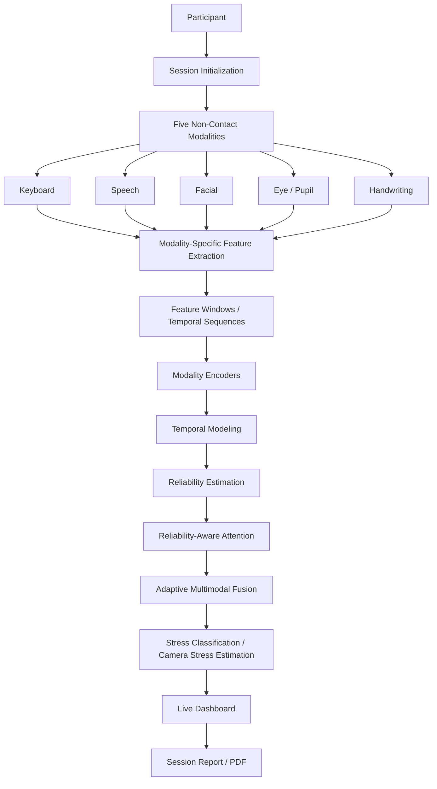

---

## System Architecture

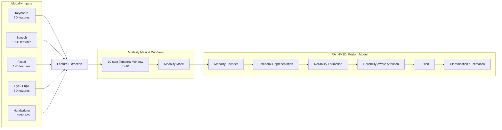

**Feature Shapes:**
- audio: `(T, 169)`
- face: `(T, 12)`
- keystroke: `(T, 7)`
- handwriting: `(T, 9)`
- eye: `(T, 5)`

*T = 10 temporal steps.*

**Current Model Validation:**
- Model Name: `RA_HMSD_Fusion_Model`
- Verified Parameter Count: 214,166 trainable parameters
- *Disclaimer: This architecture is an experimental prototype and is NOT medically validated.*

---

## Application Architecture

```mermaid
flowchart TD
    BP[Browser / Participant] --> WD[Web Dashboard]
    WD --> DEV[Camera + Microphone + Keyboard + Handwriting Canvas]
    DEV --> FB[Flask Backend]
    
    FB --> IAPI[Input Upload / Session APIs]
    IAPI --> FEL[Feature Extraction Layer]
    FEL --> MIL[Multimodal Inference Layer]
    MIL --> RM[Session State / Runtime Manager]
    RM --> DS[Dashboard State]
    RM --> PDF[PDF Report Generator]
    
    subgraph API Uploads
        CU[Camera frame upload]
        AU[Audio upload]
        KE[Keyboard events]
        HS[Handwriting submission]
    end
    
    IAPI -.-> CU & AU & KE & HS
```

---

## Multimodal Data Flow

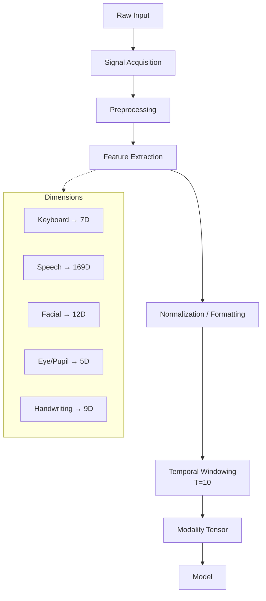
*Missing modalities in real-time are handled explicitly via the runtime modality mask. The model does not silently invent missing data.*

---

## Five-Modality Processing Pipeline

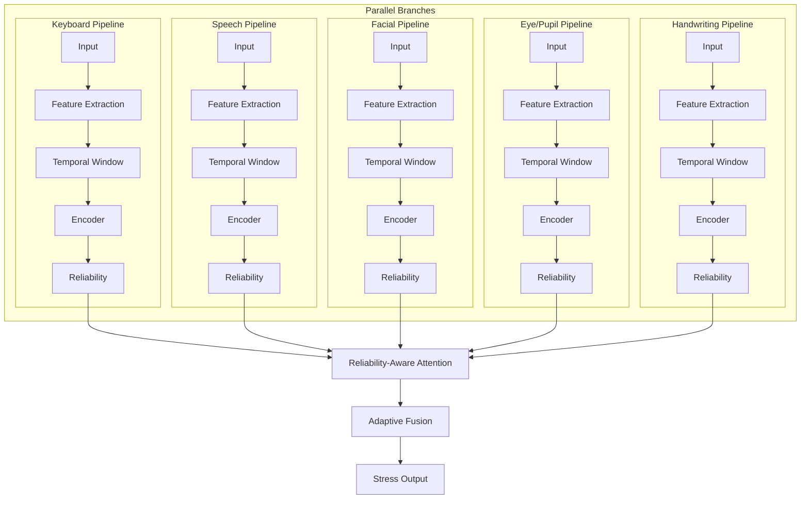

---

## Temporal Learning Architecture

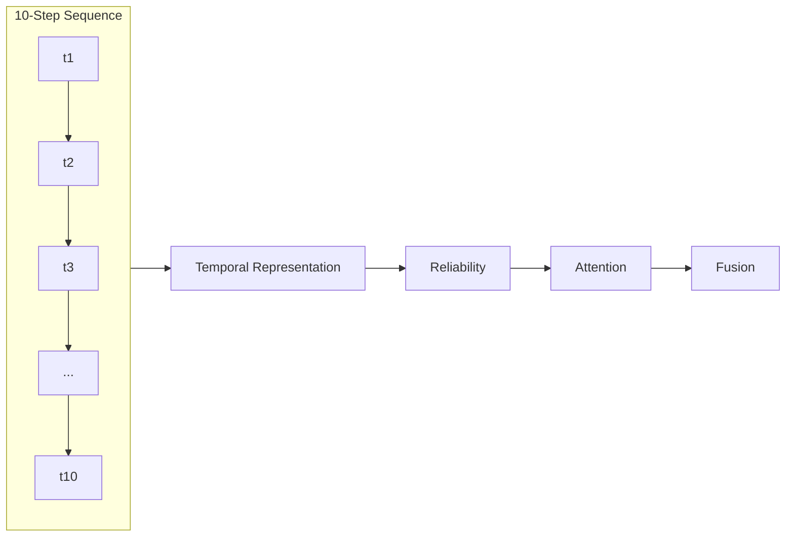

*T = 10 temporal steps. The model observes discrete temporal windows of behavioral transitions rather than evaluating isolated point-in-time samples.*

---

## Reliability-Aware Fusion

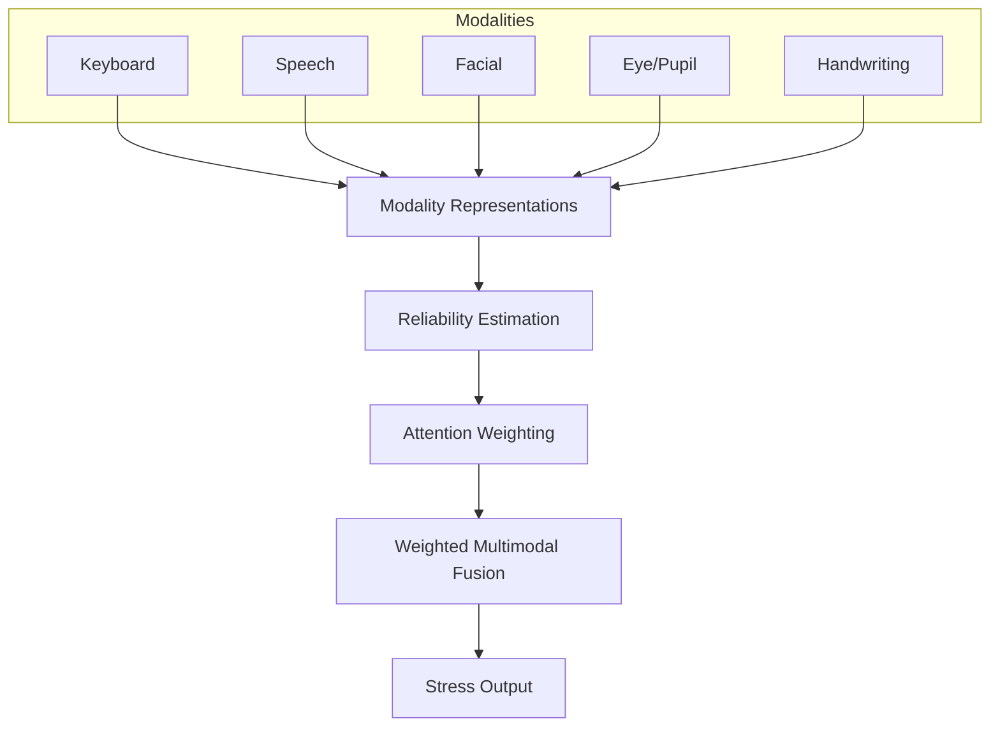
*Reliability-aware fusion dynamically suppresses the influence of weak, noisy, or temporarily missing modalities in real time. Not clinically validated.*

---

## Real-Time Inference Workflow

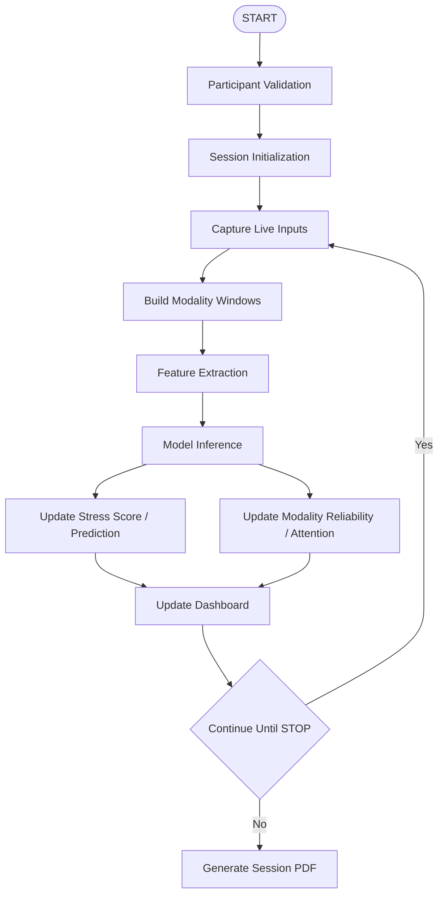

> **IMPORTANT:** The full **multimodal model inference** is conceptually distinct from the **camera-based research stress estimate** often displayed in the dashboard as a fallback heuristic.

---

## Camera Stress Estimation Pipeline

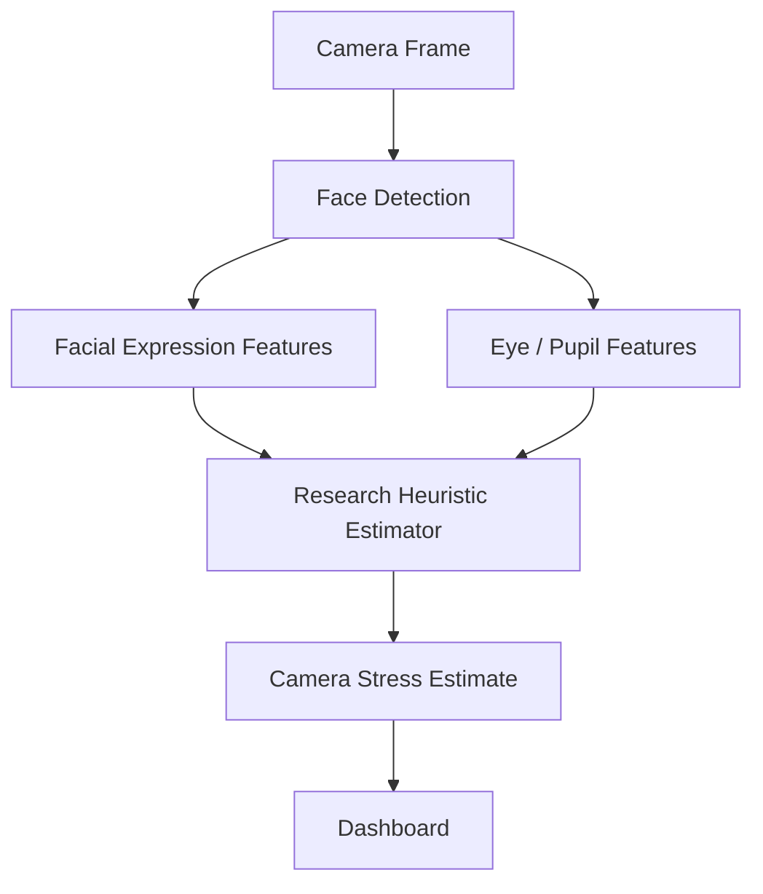

* The current camera estimator acts as a transparent research heuristic.
* **Weighting:** 70% facial expression signal, 30% eye signal.
* This is rendered in the UI strictly as: **CAMERA STRESS ESTIMATE (RESEARCH)**.
* **Disclaimer:** It is not clinically validated, a medical diagnosis, a calibrated probability, or a psychological diagnosis.

---

## Keyboard Processing Workflow

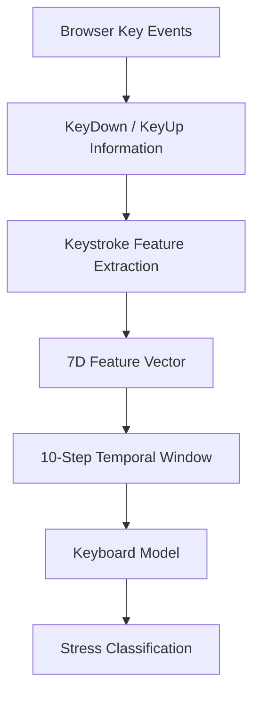

**7 Runtime Features Extracted:**
1. `mean_dwell`
2. `std_dwell`
3. `mean_flight`
4. `std_flight`
5. `typing_speed`
6. `backspace_freq`
7. `error_rate`

*The keyboard component is an experimental classification system. Its participant-independent evaluation is currently limited and does not claim robust universal accuracy.*

---

## Speech Processing Workflow

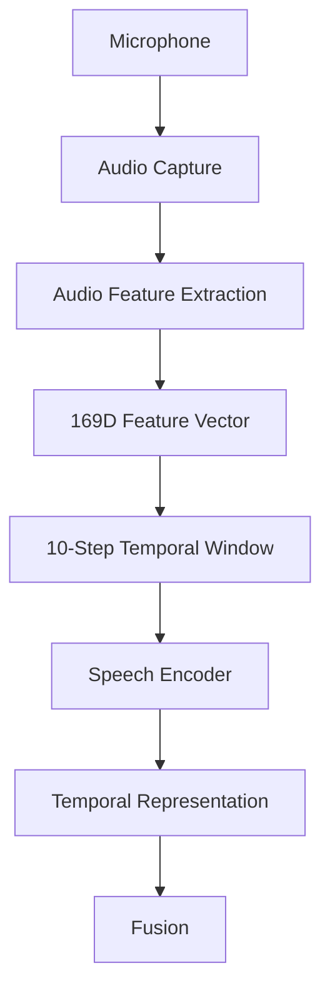

---

## Facial + Eye Processing Workflow

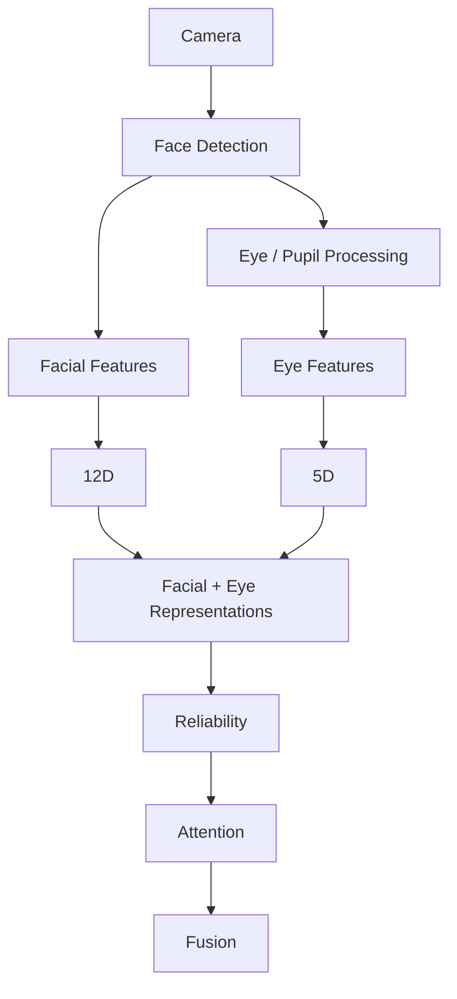
*(This pipeline feeds the RA-HMSD multimodal model and is distinct from the fallback camera research estimator.)*

---

## Handwriting Processing Workflow

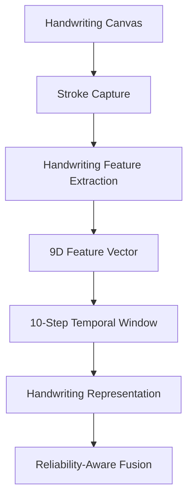
*Handwriting provides an experimental behavioral signal and is not independently validated as a universal stress measurement.*

---

## Session Lifecycle

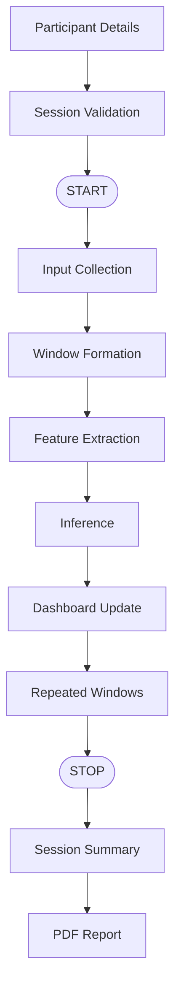
*(Participant Name, Gender, and Age are captured purely for session-level reporting and are not persistently collected.)*

---

## Dashboard Architecture

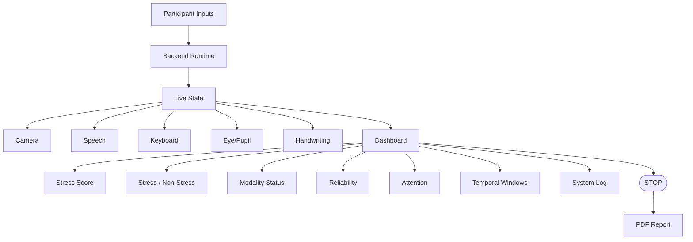

---

## PDF Report Generation Flow

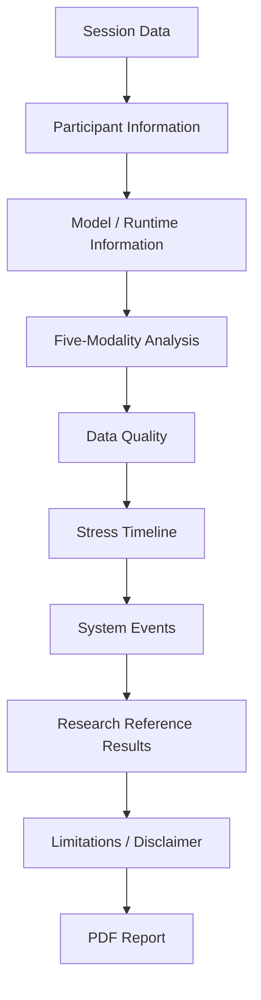

> **WARNING:** The **CURRENT SESSION RESULTS** are rigorously distinguished from **REFERENCE RESEARCH RESULTS**. The published 94.30% accuracy benchmark is a reference metric and NEVER represents the current runtime model's evaluated accuracy on a live user.

---

## Research Architecture

The system is rigorously defined for **FIVE modalities**:
$$X = \{X_k, X_s, X_f, X_e, X_h\}$$

where $m \in \{k, s, f, e, h\}$ represents:
- $k$ = Keyboard
- $s$ = Speech
- $f$ = Facial
- $e$ = Eye/Pupil
- $h$ = Handwriting

```text
X_m
→ Encoder
→ Temporal Representation
→ Reliability
→ Attention
→ Fusion
→ Classifier
```

---

## API / Runtime Architecture

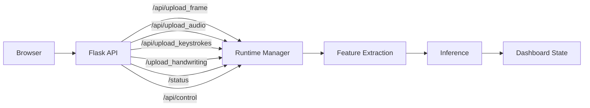

---

## Technology Architecture

| Layer | Technology | Role |
|---|---|---|
| **Frontend** | HTML/CSS/JavaScript | Live dashboard |
| **Backend** | Python + Flask | Runtime API and orchestration |
| **Computer Vision** | OpenCV / MediaPipe | Face and eye processing |
| **Speech** | Python audio pipeline | Speech feature extraction |
| **ML** | TensorFlow / Keras | Model inference |
| **Model** | RA-HMSD_Fusion_Model | Multimodal fusion |
| **Reporting** | Python (ReportLab) | PDF Session report generation |
| **Deployment** | Cloudflare Quick Tunnel | Temporary public external access |

---

## Project Structure

```text
Scalable-Non-Contact-Stress/
├── run.py                 # Primary backend and real-time inference loop
├── train.py               # Research training pipeline for multimodal networks
├── pdf_generator.py       # Session report compiler
├── requirements.txt       # Core dependencies
├── templates/
│   └── index.html         # Frontend dashboard UI
├── static/
│   ├── css/
│   └── js/
├── src/
│   ├── DL_models.py       # Keras RA-HMSD definitions
│   ├── audio_utils.py     # Speech feature extractors
│   ├── face_utils.py      # Facial expression pipelines
│   ├── eye_utils.py       # Landmark and pupil tracking
│   ├── keystroke_utils.py # Keyboard behavioral processing
│   └── handwriting_utils.py
├── scripts/               # Benchmarking and environment utilities
├── docs/                  # Architecture documentation and handoffs
├── results/               # Artifacts, logs, and compiled evaluations
├── reports/               # Generated PDF session reports
└── README.md              # Project documentation
```

---

## Datasets & Research Data Flow

* **ForDigitStress:** The primary theoretical target multimodal stress dataset providing synchronized speech, facial, eye/pupil, keyboard, and stress annotations.
* **WESAD:** A prominent physiological stress dataset based on chest-worn/wrist-worn sensors (ECG, EDA, EMG, Temp). **WESAD is physiological and NOT non-contact.**
* **Freihaut Keyboard Dataset:** Used to evaluate the `keyboard` extractor.
* **FER2013:** Utilized for foundational facial expression analysis.
* **RAVDESS:** Utilized for emotional speech feature verification.

---

## Experimental Evaluation Architecture

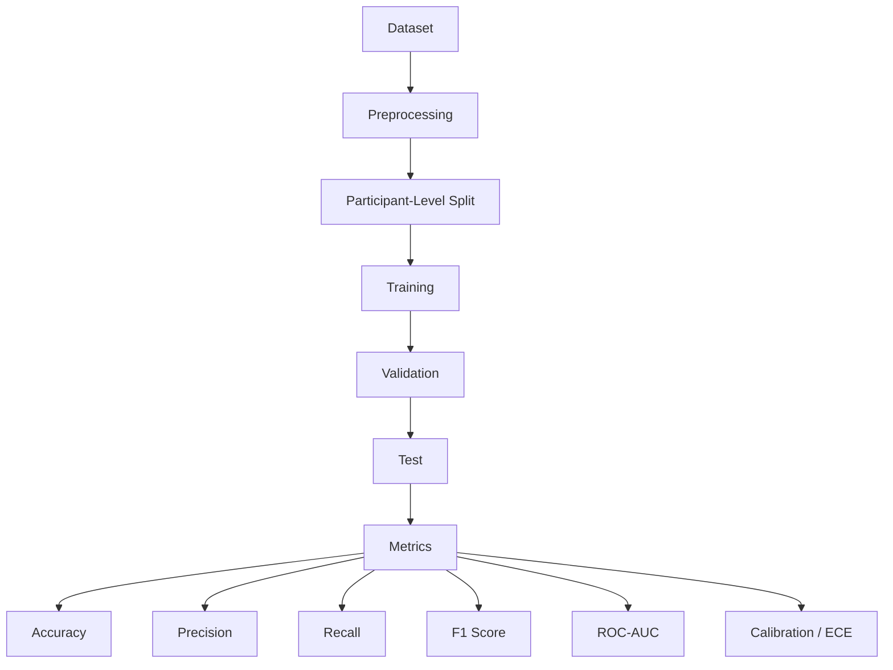
*(Note: Metrics generated from historical or private datasets represent paper results, not the live accuracy of the real-time runtime loop.)*

---

## Research vs Runtime Implementation

| Aspect | Research Architecture | Current Runtime |
|---|---|---|
| **Modalities** | 5 | 5 connected |
| **Temporal window** | T=10 | T=10 |
| **Fusion** | Reliability-aware attention | Implemented model architecture |
| **Camera estimator** | Research architecture | Transparent heuristic (70/30) |
| **Keyboard** | Experimental | Connected |
| **Speech** | Connected pipeline | Connected |
| **Facial** | Connected | Connected |
| **Eye/Pupil** | Connected | Connected |
| **Handwriting** | Connected | Connected |
| **94.30% accuracy** | Published research result | **NOT a current runtime benchmark** |

---

## Limitations

* **Camera Estimator:** The live camera stress output functions as a transparent heuristic estimator, not a neural prediction.
* **No Medical Claim:** This system provides no medical or psychological diagnosis.
* **Keyboard Evaluation:** Current participant-independent evaluation is weak and strictly experimental.
* **Handwriting Validity:** Not independently established as an authoritative stress measurement.
* **Dataset Restrictions:** Full `ForDigitStress` access and temporal alignment remain fundamentally constrained by dataset availability and EULA.
* **WESAD Representation:** WESAD is physiological and is entirely separate from the system's non-contact modalities.
* **Metric Overload:** Published runtime performance (94.30%) must not be confused with the live web architecture's performance on unseen users.
* **Tunnel Availability:** Public accessibility relies entirely on the local machine/network execution of Cloudflare tunnels.
* **Missing Modalities:** Asynchronous gaps in multimodal streams are explicitly handled by the runtime modality mask, meaning degraded signals will proportionally degrade output reliability.

---

## HOW THE INPUTS WORK
*(Reserved for future explanatory sections regarding sensor access)*
