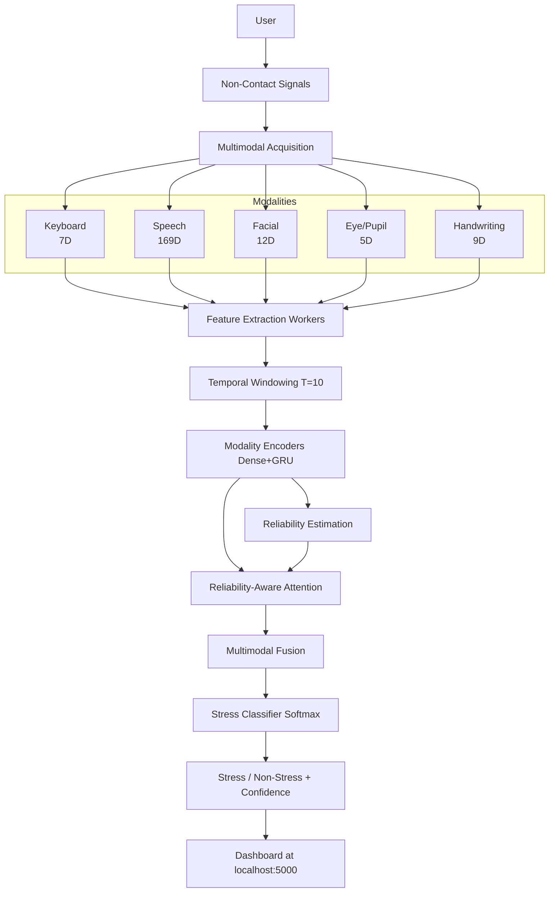

# Scalable Non-Contact Stress Detection Using Hybrid Multimodal Intelligence


A real-time, reliability-aware, hybrid multimodal stress detection system (RA-HMSD) that asynchronously processes five non-contact behavioral and physiological modalities — Speech, Facial, Keyboard, Handwriting, and Eye/Pupil.

**DISCLAIMER: This is an experimental stress classification system. It is NOT for clinical diagnosis, medical evaluation, or psychological assessment. It classifies "high stress" versus "low stress" behavioral conditions.**

## Experimental Status & Validation

The system is designed for 5 modalities, but is currently scientifically evaluated and validated **only on the Keyboard Modality**.

### Current Validated Modality: Keyboard
- **Dataset:** Freihaut & Göritz (2021) "Does People's Keyboard Typing Reflect Their Stress Level – An Explorative Study"
- **Status:** **VALIDATED (Research Only)**
- **Participants:** 977 (Train: 744, Val: 159, Test: 161)
- **Model Test Metrics (RA-HMSD Keyboard Only):**
  - Accuracy: ~46%
  - Recall (Stress): ~60%
  - F1-Score: ~0.34
- **Note:** The dataset exhibits high class imbalance (~77% non-stress). While the neural network demonstrates stress-detection signal matching classical ML baselines (like balanced Logistic Regression), the overall discriminatory power of keyboard features alone remains low, aligning with the original paper's findings.

### Experimental Modalities (Speech, Face, Eye, Handwriting)
- **Status:** **RUNTIME FEATURE EXTRACTION ONLY**
- These modalities correctly extract real-time features (MFCCs, EAR, etc.) and pass them to the fusion engine, but the model has **not** been rigorously validated on large-scale participant-independent stress datasets for these streams yet.

## Architecture



## Running the Application

```bash
# Real-time inference + dashboard
python run.py
# Open http://localhost:5000
```

The system will start up and load `results/checkpoints/freihaut_keyboard_stress.keras`. 
If the webcam is off, it gracefully masks missing features via the Reliability-Aware Attention mechanism.

## Security & Data Policy

This repository contains **only** source code, architecture definitions, preprocessing utilities, and documentation. It does **not** contain:
- Private or restricted datasets
- Downloaded dataset archives
- Participant-level data

## Citation

If you use this work, please cite:

> Abilash Aruva. "Scalable Non-Contact Stress Detection Using Hybrid Multimodal Intelligence." (2026).
