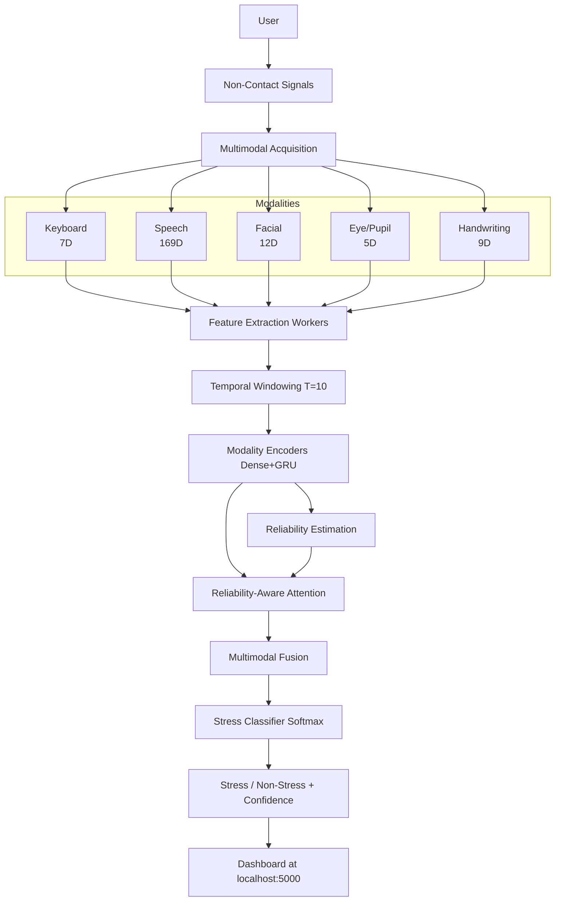
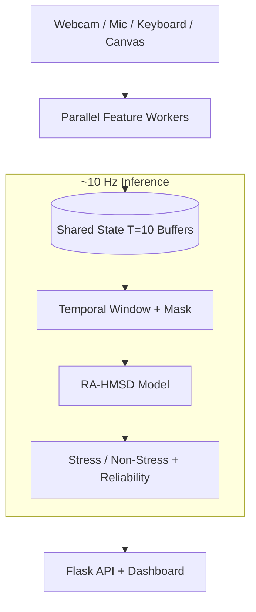

# Scalable Non-Contact Stress Detection Using Hybrid Multimodal Intelligence


A real-time, reliability-aware, hybrid multimodal stress detection system (RA-HMSD) that asynchronously processes five non-contact behavioral and physiological modalities — Speech, Facial, Keyboard, Handwriting, and Eye/Pupil — to classify stress. The system gracefully handles missing or unreliable modalities through a learned attention mechanism.

## Architecture



## Multimodal Pipeline

| Modality | Features | Temporal Input | Source |
|----------|----------|----------------|--------|
| Speech | 169D (MFCCs, chroma, mel, contrast, ZCR, RMS, F0, jitter, shimmer, formants, silence) | 10 × 169 | `src/audio_utils.py` |
| Facial | 12D (EAR, head pose, MAR, brow raise, mouth width, lip distance, nose wrinkle, jaw drop) | 10 × 12 | `src/face_utils.py` |
| Keyboard | 7D (dwell mean/std, flight mean/std, typing speed, pause rate, correction rate) | 10 × 7 | `src/keystroke_utils.py` |
| Handwriting | 9D (stroke width, slant, density, aspect ratio, pressure proxy, velocity, timing) | 10 × 9 | `src/handwriting_utils.py` |
| Eye/Pupil | 5D (pupil size L/R, gaze X/Y, eye closure) | 10 × 5 | `src/eye_utils.py` |

## Reliability-Aware Fusion

1. **Modality encoding:** `Hm = GRU(Dense(Xm))`
2. **Reliability:** `rm = σ(Wr · Hm)`
3. **Attention:** `αm = softmax(Wa · (Hm ⊙ rm) + mask_penalty)`
4. **Fusion:** `F = Σ αm · Hm`
5. **Classification:** `ŷ = softmax(Wc · F)`

Missing modalities receive a `-1e9` mask penalty, driving their attention weight to ~0.

## Real-Time Data Flow



## Installation

```bash
git clone https://github.com/Abilash77/Scalable-Non-Contact-Stress.git
cd Scalable-Non-Contact-Stress
python -m venv venv
venv\Scripts\activate   # Windows
pip install -r requirements.txt
pip install -e .
```

## Running

```bash
# Real-time inference + dashboard
python run.py
# Open http://localhost:5000

# Training (requires ForDigitStress dataset)
python train.py
```

**Important:** Running `python run.py` does NOT train the model. It loads an existing checkpoint. Without a valid stress checkpoint, the system operates in **UNTRAINED / ARCHITECTURE TEST ONLY** mode.

## Project Structure

```
├── src/                    # Core ML: model architecture + feature extractors
├── scripts/
│   ├── preprocessing/      # Dataset preprocessing pipelines
│   ├── training/           # Training scripts
│   ├── evaluation/         # Stability tests, camera tests
│   ├── analysis/           # Statistical analysis, plotting
│   └── realtime/           # Alternative server implementations
├── configs/                # Experiment configurations
├── templates/              # Dashboard HTML
├── data/                   # Datasets (NOT bundled — see below)
├── results/                # Outputs, logs, checkpoints
├── run.py                  # Main entry: real-time inference + dashboard
├── train.py                # Main entry: ForDigitStress training
├── train_swell.py          # SWELL-KW training pipeline
├── requirements.txt        # Dependencies
└── docs/PROJECT_HANDOFF.md # Detailed developer handoff document
```

## Dataset Policy

**This repository does NOT include datasets, trained checkpoints, or model weights.**

- Private/restricted datasets must be obtained separately from their providers
- Downloaded archives must not be committed
- Trained model weights are local-only artifacts
- See [docs/PROJECT_HANDOFF.md](docs/PROJECT_HANDOFF.md) for the complete dataset inventory and acquisition instructions

The primary intended dataset is **ForDigitStress** — request access at [hcai.eu/fordigitstress/](https://hcai.eu/fordigitstress/).

## Experimental Status

| Component | Status |
|-----------|--------|
| Model architecture (RA-HMSD, 214K params) | ✅ Implemented |
| Five-modality feature extractors | ✅ Implemented |
| Dynamic modality masking | ✅ Implemented |
| Reliability-aware attention fusion | ✅ Implemented |
| Real-time dashboard (10 Hz) | ✅ Implemented |
| Webcam / face / eye detection | ✅ Hardware tested |
| Stress training dataset | ❌ Not bundled |
| Legitimate stress checkpoint | ❌ Not available |
| End-to-end stress validation | ❌ Pending dataset |

## Security & Data Policy

This repository contains **only** source code, architecture definitions, preprocessing utilities, and documentation. It does **not** contain:
- Private or restricted datasets
- Downloaded dataset archives
- Trained model weights or checkpoints
- API keys, passwords, or credentials
- Participant-level data

Environment variables (if needed) should be configured via `.env` — see `.env.example`.

## Detailed Documentation

For complete architecture details, dataset inventory, checkpoint audit, and step-by-step developer onboarding, see:

📄 **[docs/PROJECT_HANDOFF.md](docs/PROJECT_HANDOFF.md)**

## Citation

*This is an independent engineering implementation of a multimodal stress detection architecture.*

> Maike Stoeve, et al. "Scalable Non-Contact Stress Detection Using Hybrid Multimodal Intelligence."
