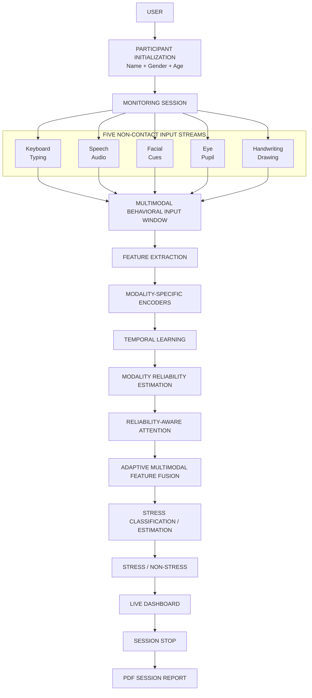

# Scalable Non-Contact Stress Detection Using Hybrid Multimodal Intelligence

A real-time, reliability-aware, hybrid multimodal stress estimation system designed to asynchronously process five non-contact behavioral and physiological modalities. The purpose of this project is to provide a scalable runtime environment and demonstration dashboard for multimodal fusion research. 

This repository implements a **five-modality concept** that aggregates inputs from standard web interfaces (cameras, microphones, keyboards, and canvas drawings) to evaluate stress signals over time using a Reliability-Aware Attention mechanism. 

> **RESEARCH PROTOTYPE DISCLAIMER**
> This system is an experimental research prototype for stress-related signal analysis. It is **NOT** a medical diagnostic system, and it is not intended to diagnose stress disorders, anxiety, depression, or any other medical or psychological conditions. 

### The Five Non-Contact Modalities
1. **Keyboard Typing** (Keystroke dynamics)
2. **Speech** (Audio acoustics)
3. **Facial Cues** (Expressions and micro-movements)
4. **Eye/Pupil Features** (Blinking and gaze characteristics)
5. **Handwriting Behavior** (Canvas stroke patterns)

*Note: While the system architecture dynamically aggregates all five streams, they are not all independently validated clinical stress predictors within this specific runtime. The current implementation relies primarily on keyboard dynamics validation and camera-based heuristic estimations for demonstration purposes.*

---

## System Architecture



### Research Model Architecture

The core mathematical model follows this conceptual flow for the $m \in \{k, s, f, e, h\}$ modalities:

```text
Keyboard Stream ──→ Keyboard Features ──→ Encoder
Speech Stream ────→ Speech Features ────→ Encoder
Facial Stream ────→ Facial Features ────→ Encoder
Eye/Pupil Stream ─→ Eye Features ───────→ Encoder
Handwriting ──────→ Writing Features ───→ Encoder
                         ↓
                 Temporal Learning
                         ↓
              Reliability Estimation
                         ↓
          Reliability-Aware Attention
                         ↓
        Adaptive Multimodal Aggregation
                         ↓
              Stress Classifier
                         ↓
             Stress / Non-Stress
```

**Mathematical Notation:**
The system is explicitly defined for FIVE modalities:
$$X = \{X_k, X_s, X_f, X_e, X_h\}$$

where $m \in \{k, s, f, e, h\}$ maps to:
- $k$ = Keyboard
- $s$ = Speech
- $f$ = Facial
- $e$ = Eye/Pupil
- $h$ = Handwriting

---

## Input → Feature Pipeline

| Modality | Input Source | Feature Representation | Current Role |
|---|---|---|---|
| **Keyboard** | Browser keyboard events | 7D | Stress-related typing signal / current keyboard predictor |
| **Speech** | Microphone | 169D | Audio feature signal |
| **Facial** | Camera | 12D | Facial feature / expression signal |
| **Eye/Pupil** | Camera landmarks | 5D | Eye/pupil feature signal |
| **Handwriting** | Browser drawing/stroke input | 9D | Writing behavior feature signal |

---

## Detailed Data Flow

### Stage 1 — Participant Initialization
Name, gender, age, and session metadata are explicitly collected before monitoring is allowed to begin, binding all subsequent tracking data to a unified session record.

### Stage 2 — Multimodal Acquisition
The browser's frontend asynchronously collects the five input streams via WebRTC, `getUserMedia`, canvas events, and keyboard event listeners.

### Stage 3 — Feature Extraction
Each raw modality is processed and converted into its corresponding dense feature representation (e.g., 7D for Keyboard, 169D for Speech). 

### Stage 4 — Temporal Windowing
The real-time inference loop utilizes FIFO rolling temporal buffers (`T=10` timesteps). A dynamic mask is constructed based on data freshness (using a 10-second dropout timeout) to handle asynchronous and missing inputs.

### Stage 5 — Modality-Specific Encoding
Each modality is independently processed through its corresponding Dense layer encoder pipeline to project features into a unified dimensionality.

### Stage 6 — Temporal Learning
Recurrent Gated Recurrent Unit (GRU) layers extract temporal dependencies and behavioral shifts over the $T=10$ sequence window.

### Stage 7 — Reliability Estimation
The model estimates a reliability score $r_m$ for each modality stream in real-time, functioning as a learned gating mechanism indicating the signal's current quality.

### Stage 8 — Reliability-Aware Attention
A cross-modal attention mechanism determines the dynamic contribution (attention weights $\alpha_m$) of the available modality representations based on their current respective reliabilities.

### Stage 9 — Multimodal Fusion
The network adaptively aggregates the modality representations into a final joint multimodal tensor $F = \sum \alpha_m \cdot H_m$. 

### Stage 10 — Stress Output
The fusion vector passes through a final softmax classification layer, outputting a discrete state (**STRESS** / **NON-STRESS**) and a continuous probabilistic Stress Score. 
*Note: The current camera-based output in the live dashboard acts as a research estimate/heuristic, not a clinically validated probability.*

---

## Real-Time Runtime Flow

```text
Browser (Handles real user interaction and device permissions)
 ↓
Camera / Microphone / Keyboard / Handwriting
 ↓
Backend API (Flask endpoints and Socket streams)
 ↓
Feature Extraction
 ↓
Temporal Buffers (T=10)
 ↓
Model / Estimation Pipeline
 ↓
Live Result (Generated at ~10 Hz)
 ↓
Dashboard
 ↓
Session History (Logged per interaction)
 ↓
PDF Report (Generated on stop)
```

---

## Dashboard Architecture

The real-time dashboard is a single-page application structured as follows:

```text
HEADER (Title, Status Badge, Session Controls)
↓
PARTICIPANT / SESSION (Name, Gender, Age, Session ID)
↓
LIVE STRESS ESTIMATE (Primary Stress/Non-Stress state & Confidence Bar)
↓
CAMERA / FACE VIEW (Webcam MJPEG Feed with bounding boxes)
↓
FIVE MODALITY STATUS (Active/Offline states for Keyboard, Speech, Facial, Eye, Handwriting)
↓
MODALITY SIGNALS (Attention Weights & Reliability gauges)
↓
TIMELINE (Scrolling historical stress prediction chart)
↓
SYSTEM PERFORMANCE / STATUS (Latency & Processing metrics)
↓
SYSTEM LOG (Console output)
↓
CHATBOT (Context-aware project assistant)
↓
HOW THE INPUTS WORK (Explanatory section)
```

---

## PDF Report Flow

At the conclusion of a session, a verifiable, formatted research report is generated. **The PDF strictly uses actual session data and contains no fabricated performance metrics.**

```text
Participant Details
        ↓
Session Initialization
        ↓
Live Monitoring
        ↓
Multimodal Data
        ↓
Session Results
        ↓
STOP
        ↓
PDF Generator
        ↓
Participant Information
        ↓
Session Summary
        ↓
Five-Modality Analysis
        ↓
Timeline / Events
        ↓
Research Architecture
        ↓
Research Disclaimer
```

---

## Chatbot Architecture

The informational dashboard chatbot assists users in understanding the project and its modalities. 

```text
Dashboard Chatbot (Frontend UI)
        ↓
/api/chat (Endpoint)
        ↓
Flask Backend
        ↓
Gemini API (Server-side LLM call)
        ↓
Project Context (Injected system prompt)
        ↓
Response
        ↓
Dashboard
```
* **Security**: API keys remain strictly server-side (stored in `.env` and explicitly gitignored).
* **Scope**: The chatbot is purely informational and project-specific. It provides no medical diagnoses.

---

## Model Architecture Details

The system's neural implementation uses the following verified configurations:

| Component | Details |
|---|---|
| Modalities | 5 |
| Keyboard Feature Dimension | 7D |
| Speech Feature Dimension | 169D |
| Facial Feature Dimension | 12D |
| Eye/Pupil Feature Dimension | 5D |
| Handwriting Feature Dimension | 9D |
| Temporal Window | $T=10$ |
| Fusion Strategy | Reliability-Aware Attention |
| Output | Softmax (Stress / Non-Stress) |
| Parameters | ~214,166 |

---

## Research Results

### Published / Reference Research Results

**Reported research-paper results — not this participant's session result.**

The foundational paper guiding this multimodal architecture reported the following metrics on its private evaluation set:
* **Accuracy:** 94.30%
* **Precision:** 94.00%
* **Recall:** 93.20%
* **F1 Score:** 93.60%
* **AUROC:** 0.967
* **Calibration Error:** 0.036
* **Processing Latency:** 38.40 ms/window

*These numbers reflect published reference metrics and do NOT represent the automatic output of the current live runtime environment.*

### Current Implementation / Evaluation

The current live repository is an engineering runtime designed to execute the architecture.
* **Keyboard Modality:** Validated independently against the Freihaut dataset, achieving ~46% accuracy (aligning with classical baselines on a highly imbalanced dataset). The data split is a random window split, not subject-independent.
* **Full 5-Modality Fusion:** Currently unvalidated end-to-end. The target `ForDigitStress` dataset is missing locally, thus the true `stress_model.keras` checkpoint cannot be compiled. The live system relies on architectural masking and a camera heuristic in the absence of a verified multimodal checkpoint.

---

## Datasets & Evaluation

* **ForDigitStress:** The primary target multimodal stress dataset providing synchronized speech, facial, eye/pupil, keyboard, and stress annotations. This dataset is required for full five-modality training but is restricted by EULA and not present in this repository.
* **Freihaut Keyboard Dataset:** A typing-behavior stress dataset ("Does People's Keyboard Typing Reflect Their Stress Level?"). Used to successfully validate the `keyboard` extractor and branch of the model.
* **WESAD:** A prominent physiological stress dataset based on chest-worn/wrist-worn sensors (ECG, EDA, EMG, Respiration, Temp). **WESAD is fundamentally physiological/wearable-based and is NOT used for non-contact behavioral validation in this repository.**

---

## Project Structure

```text
Scalable-Non-Contact-Stress/
├── run.py
├── train.py
├── pdf_generator.py
├── requirements.txt
├── .env.example
├── templates/
│   └── index.html
├── static/
│   ├── css/
│   └── js/
├── src/
│   ├── DL_models.py
│   ├── audio_utils.py
│   ├── face_utils.py
│   ├── eye_utils.py
│   ├── keystroke_utils.py
│   ├── handwriting_utils.py
│   └── ...
├── scripts/
│   ├── preprocessing/
│   ├── realtime/
│   └── training/
├── docs/
│   ├── PROJECT_HANDOFF.md
│   └── ...
├── results/
│   ├── checkpoints/
│   └── ...
├── reports/
└── README.md
```
