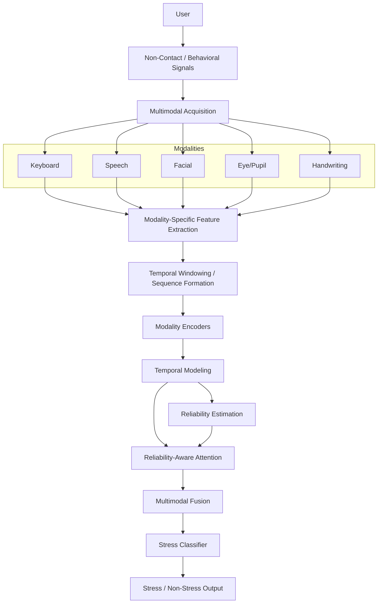
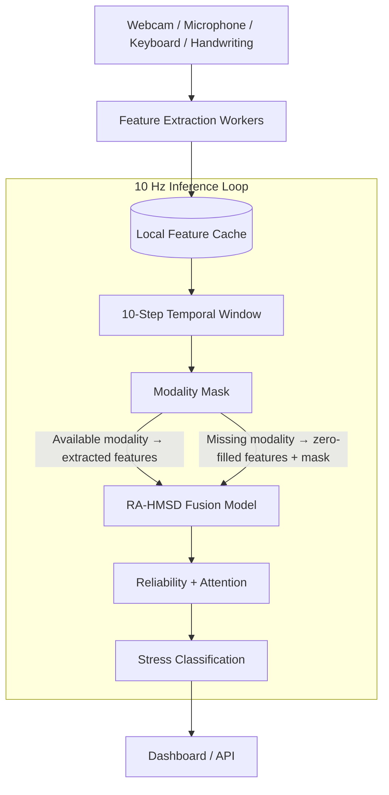

# Scalable Non-Contact Stress Detection Using Hybrid Multimodal Intelligence


A modular, real-time, hybrid multimodal stress detection system (RA-HMSD) capable of asynchronously processing non-contact behavioral and physiological signals (Speech, Facial, Keyboard, Handwriting, and Eye/Pupil) to classify stress.

## Overview
This repository contains the engineering implementation of the RA-HMSD architecture. The system introduces a reliability-aware multimodal fusion mechanism that dynamically attends to available modalities while robustly handling asynchronous or entirely missing data streams without blocking real-time inference.

## Key Features
- **Decoupled Architecture**: Fast asynchronous workers for feature extraction that do not block the central model inference.
- **Dynamic Modality Masking**: Automatically ignores stale or missing modalities using a temporal state mask.
- **Reliability-Aware Fusion**: Learns to weight features not just by their content, but by the estimated reliability of the modality at that moment.
- **Professional Diagnostic Dashboard**: A real-time web UI showing 10 Hz telemetry, individual sensor statuses, temporal windows, and internal pipeline latencies.

## System Architecture

The overarching system leverages individual modality encoders (CNN/LSTM based) that feed into a central attention and fusion module.

## Architecture Flow



## Multimodal Pipeline

| Modality | Runtime Features | Temporal Input |
|----------|------------------|----------------|
| Speech | 169D | 10 × 169 |
| Facial | 12D | 10 × 12 |
| Keyboard | 7D | 10 × 7 |
| Handwriting | 9D | 10 × 9 |
| Eye/Pupil | 5D | 10 × 5 |

**Speech**: Extracts acoustic and prosodic features representing vocal tension.
**Facial**: Analyzes geometric action units, head pose, and micro-expressions.
**Keyboard**: Captures key-hold times, latency, and typing cadence.
**Handwriting**: Extracts pen pressure, velocity, and stroke dynamics.
**Eye/Pupil**: Captures gaze patterns, pupil dilation, and blink rate.

## Reliability-Aware Fusion

The project implements a custom fusion process to gracefully handle noisy or missing modalities. Let $X_m$ be the raw temporal sequence for modality $m$:

1. **Modality-specific encoding**: $Z_m = \phi_m(X_m; \theta_m)$
2. **Temporal representation**: $H_m = \psi_m(Z_m; \omega_m)$
3. **Reliability estimation**: $r_m = \sigma(W_r H_m + b_r)$
4. **Attention weighting**: $\alpha_m = \text{softmax}(W_a \cdot f(H_m, r_m))$
5. **Multimodal fusion**: $F = \sum \alpha_m H_m$
6. **Classification**: $\hat{y} = \text{softmax}(W_c F + b_c)$

*(Note: These equations represent the implemented software architecture and require scientific validation via an end-to-end dataset).*

## Data Flow

The real-time pipeline is strictly decoupled to ensure smooth execution.



This decoupled architecture:
- Avoids blocking model inference on slow feature extraction (like deep face/audio models).
- Supports asynchronous modality updates.
- Handles stale/missing modalities seamlessly via masking.
- Reduces unnecessary HTTP/IPC overhead.
- Allows real-time dashboard updates at ~10 Hz.

## Model Architecture

**RA_HMSD_Fusion_Model**
Current expected inputs:
- `audio`: `(batch, 10, 169)`
- `face`: `(batch, 10, 12)`
- `keystroke`: `(batch, 10, 7)`
- `handwriting`: `(batch, 10, 9)`
- `eye`: `(batch, 10, 5)`
- `mask`: `(batch, 5)`

Output:
- `output`: `(batch, 2)`

Current parameter count: **214,166**
Current model size: **~836.59 KB**

## Training Pipeline

Training is an explicitly separate operation from live inference. To execute training:

```bash
python train.py
```
*(Requires a valid, preprocessed dataset mapped in the `data/` directory).*

## Real-Time Inference Pipeline

To launch the live inference application and dashboard:

```bash
python run.py
```
**Important:** Starting the application does NOT automatically train the model. Inference loads an existing valid checkpoint. If a valid stress checkpoint is unavailable, the application operates safely in **UNTRAINED / ARCHITECTURE TEST ONLY** mode.

## Project Structure

```text
├── configs/            # Configuration and hyperparameter files
├── data/               # Raw and processed datasets (Not bundled)
├── results/            # Validation reports, checkpoints, logs
├── scripts/
│   ├── analysis/       # Statistical and error analysis scripts
│   ├── evaluation/     # Stability tests and metric extraction
│   ├── preprocessing/  # Data cleaning and feature mapping
│   ├── realtime/       # Dashboards, webcam server, Flask APIs
│   └── training/       # Model training scripts
├── src/                # Core ML architecture and utilities
│   ├── audio_utils.py
│   ├── face_utils.py
│   ├── keystroke_utils.py
│   ├── handwriting_utils.py
│   ├── eye_utils.py
│   └── DL_models.py
├── templates/          # HTML Templates for the dashboard
├── run.py              # Main entry point for Real-Time Inference
├── train.py            # Main entry point for Training
├── requirements.txt    # Project dependencies
└── README.md
```

## Installation

```bash
# Clone the repository
git clone https://github.com/Abilash77/Scalable-Non-Contact-Stress.git
cd Scalable-Non-Contact-Stress

# Create a virtual environment
python -m venv venv
source venv/bin/activate  # On Windows: venv\Scripts\activate

# Install dependencies
pip install -r requirements.txt
pip install -e .
```

## Running the System

```bash
python run.py
```

## Dashboard
The professional monitoring dashboard operates at `http://localhost:5000/`. It provides:
- Real-time hardware camera stream with face detection overlays.
- Independent modality health status and latency.
- 10-step temporal window buffers.
- Model reliability and attention coefficients.
- High-resolution pipeline performance metrics.
- Start/stop/reset session controls.

## Dataset
The intended primary multimodal stress dataset is **ForDigitStress**. 
**The repository does NOT include the ForDigitStress dataset or any other restricted private datasets.** 
Dataset access, acquisition, and terms of use must be handled separately through the respective dataset providers. Local preprocessing (`scripts/preprocessing/`) requires the actual physical `.csv` and archive files mapped securely in your local environment.

## Experimental Status

### Current Experimental Status

| Component | Status |
|-----------|--------|
| Model architecture | Available |
| Five-modality runtime | Available |
| Dynamic modality masking | Available |
| Real-time dashboard | Available |
| Webcam / face detection | Hardware tested |
| Stress training dataset | Not bundled |
| Legitimate stress checkpoint | Not available |
| End-to-end stress validation | Pending |

**Note**: The system is fully engineered, physically tested, and verified for real-time temporal sequence generation. However, end-to-end stress prediction validation remains pending the acquisition of a legitimate training checkpoint.

## Performance
*These are engineering runtime pipeline measurements, NOT scientific stress-detection accuracy.*

Based on verified local benchmarks (via `scripts/evaluation/stability_test.py`):
- **Model Forward Pass (P50):** ~9.90 ms
- **Scheduler Update Interval (P50):** ~108.71 ms (~8.90 Hz)
- **Local HTTP Overhead (P50):** ~7.63 ms
- **Feature Extraction:** Completely decoupled (can take > 50ms without dropping the inference scheduler loop).

## Limitations
- **No Bundled Data**: There are no bundled private or restricted datasets included in this repository.
- **Pending Training Checkpoint**: A fully-trained multimodal stress checkpoint is not currently available in the repository.
- **Untrained Fallback**: Without a checkpoint, the live system operates strictly in `ARCHITECTURE TEST ONLY` mode.
- **Unverified End-to-End Accuracy**: The end-to-end stress accuracy has not yet been independently reproduced.
- **Hardware vs. Science**: Physical hardware camera validation establishes data ingestion reliability, but does not equal scientific model validation.
- **Missing Modalities**: Some modalities (like eye tracking or pen pressure) may be unavailable depending on the real-world deployment environment (gracefully handled by the masking layer).

## Reproducibility
All Python configurations, preprocessing scripts, model definitions, and pipeline orchestration files are provided to allow absolute reproducibility once the private datasets are locally acquired.

## Future Work
- Legitimate multimodal stress dataset acquisition and alignment.
- Verified physical timestamp alignment across 5 separate sensor devices.
- End-to-end stress training and hyperparameter tuning.
- Subject-independent and cross-subject generalization evaluation.
- Sensor calibration evaluation.
- Ablation studies (feature vs. reliability-aware fusion).
- Robustness validation under systematically missing modalities.
- On-device and Edge deployment optimization.

## Citation
*This implementation is an independent engineering reproduction.*
If referencing the underlying theoretical research architecture:

> Maike Stoeve, et al. "Scalable Non-Contact Stress Detection Using Hybrid Multimodal Intelligence." (Pending specific publication attribution details).

## License
MIT License.
