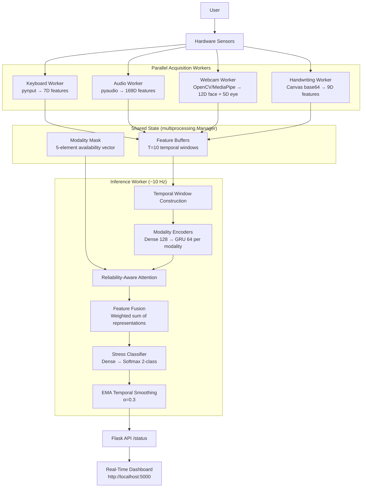
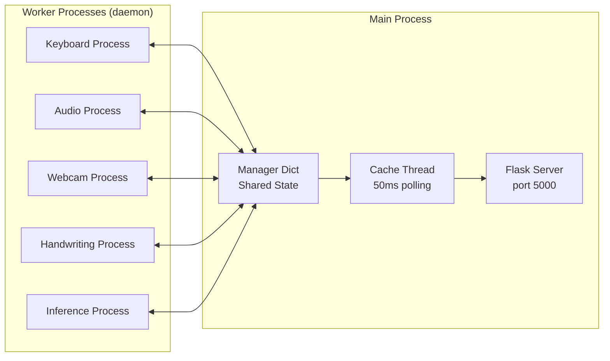

# Project Handoff — RA-HMSD (Reliability-Aware Hybrid Multimodal Stress Detection)

> **Date Generated:** 2026-09-20
> **Prepared By:** Automated evidence-based audit of local project filesystem.
> **Audience:** A new developer taking over or contributing to this project.

---

## 1. Project Overview

This project implements a **real-time, non-contact, multimodal stress detection system** called **RA-HMSD** (Reliability-Aware Hybrid Multimodal Stress Detector). It captures five behavioral/physiological modalities from commodity hardware (webcam, microphone, keyboard) and fuses them through a reliability-aware attention mechanism to classify **Stress vs. Non-Stress** in real-time.

**Core contribution:** The system can operate with *any subset* of the five modalities available at any time; missing or unreliable modalities are gracefully masked out by a learned attention mechanism, rather than blocking inference.

**Current state:** The complete software architecture, real-time pipeline, dashboard, and feature extraction are implemented and runtime-tested. **No legitimate end-to-end stress checkpoint has been trained or validated** as of this handoff, because the required training dataset (ForDigitStress) has not been obtained.

---

## 2. What This Project Does

1. **Acquires** five non-contact modalities asynchronously (keyboard, speech, facial, eye/pupil, handwriting)
2. **Extracts** modality-specific feature vectors in parallel worker processes
3. **Buffers** features into temporal windows of length T=10
4. **Constructs** a modality availability mask based on which sensors are producing valid data
5. **Fuses** the modality representations through reliability-aware attention
6. **Classifies** the fused representation as Stress or Non-Stress (binary softmax)
7. **Serves** results via a Flask API and a professional real-time dashboard at `http://localhost:5000`
8. **Logs** all inference cycles to `results/realtime_session.log`

---

## 3. Current System Architecture

The system uses a **multiprocessing architecture** with 5 parallel worker processes + 1 inference process + 1 Flask server thread:

| Process | Role |
|---------|------|
| `keyboard_worker` | Captures keypress/release events via `pynput`, extracts 7D features |
| `audio_worker` | Records 3-second audio chunks via `pyaudio`, extracts 169D features |
| `webcam_worker` | Captures webcam frames via OpenCV, extracts 12D facial + 5D eye features |
| `handwriting_worker` | Processes base64-encoded handwriting images from dashboard, extracts 9D features |
| `inference_worker` | Reads feature buffers, constructs temporal windows, runs model inference |
| Flask server (main thread) | Serves dashboard HTML and JSON API endpoints |
| Cache updater (thread) | Bridges multiprocessing shared state to Flask response cache |

---

## 4. Complete Architecture Flow



### Real-Time Worker/Cache Architecture



---

## 5. Five Modalities

### 5.1 Keyboard

| Property | Value |
|----------|-------|
| **Input** | Real-time key press/release events from `pynput` |
| **Features (7D)** | dwell_mean, dwell_std, flight_mean, flight_std, typing_speed, pause_rate, correction_rate |
| **Source file** | `src/keystroke_utils.py` |
| **Temporal representation** | `(batch, 10, 7)` |
| **Current status** | Feature extraction implemented and runtime-tested |
| **Dataset dependency** | No stress-labeled keystroke dataset present locally |

### 5.2 Speech

| Property | Value |
|----------|-------|
| **Input** | 3-second 16kHz audio chunks from `pyaudio` |
| **Features (169D)** | 13 MFCCs + 12 chroma + 128 mel-spectrogram + 7 spectral contrast + 1 ZCR + 1 RMS + 3 (F0, jitter, shimmer) + 3 formants + 1 silence ratio |
| **Source file** | `src/audio_utils.py` |
| **Temporal representation** | `(batch, 10, 169)` |
| **Current status** | Feature extraction implemented and runtime-tested |
| **Dataset dependency** | RAVDESS audio dataset present locally (emotion proxy, NOT stress) |

### 5.3 Facial

| Property | Value |
|----------|-------|
| **Input** | Webcam frames processed by MediaPipe Face Mesh |
| **Features (12D)** | EAR_left, EAR_right, pitch, yaw, roll, MAR, brow_raise_left, brow_raise_right, mouth_width, lip_distance, nose_wrinkle, jaw_drop |
| **Source file** | `src/face_utils.py` |
| **Temporal representation** | `(batch, 10, 12)` |
| **Current status** | Feature extraction implemented and runtime-tested |
| **Dataset dependency** | FER2013 present locally (facial emotion recognition proxy, NOT stress) |

### 5.4 Eye/Pupil

| Property | Value |
|----------|-------|
| **Input** | Webcam frames processed by MediaPipe Iris Landmarks |
| **Features (5D)** | pupil_size_left, pupil_size_right, gaze_x, gaze_y, eye_closure |
| **Source file** | `src/eye_utils.py` |
| **Temporal representation** | `(batch, 10, 5)` |
| **Current status** | Feature extraction implemented and runtime-tested |
| **Dataset dependency** | No eye/pupil stress dataset present locally |

### 5.5 Handwriting

| Property | Value |
|----------|-------|
| **Input** | Grayscale handwriting image (from dashboard canvas or file) |
| **Features (9D)** | stroke_width_mean, stroke_width_std, slant_mean, slant_std, density, aspect_ratio, pressure_proxy, stroke_velocity (placeholder), timing_ratio (placeholder) |
| **Source file** | `src/handwriting_utils.py` |
| **Temporal representation** | `(batch, 10, 9)` |
| **Current status** | Feature extraction implemented; velocity/timing are placeholder zeros for static images |
| **Dataset dependency** | Handwriting personality dataset present (neuroticism proxy, NOT stress) |

---

## 6. Feature Dimensions

Verified from `src/DL_models.py` lines 61–68 and `run.py` lines 311–317:

| Modality | Feature Dim | Temporal Steps | Input Shape |
|----------|-------------|----------------|-------------|
| Speech/Audio | 169 | 10 | `(10, 169)` |
| Facial | 12 | 10 | `(10, 12)` |
| Keystroke | 7 | 10 | `(10, 7)` |
| Handwriting | 9 | 10 | `(10, 9)` |
| Eye/Pupil | 5 | 10 | `(10, 5)` |
| **Mask** | 5 | — | `(5,)` |

---

## 7. Model Architecture

**Model name:** `RA_HMSD_Fusion_Model`
**Defined in:** `src/DL_models.py`

### Components:

1. **ModalityBranch** (×5, one per modality)
   - `Dense(128, relu, L2=1e-4)` → `Dropout(0.3)` → `GRU(64, return_sequences=False, L2=1e-4)`
   - Produces a 64D hidden representation `hm` per modality

2. **Unimodal Classifiers** (×5)
   - `Dense(2, softmax)` per modality for auxiliary supervision during training

3. **ReliabilityAttention**
   - Per modality: `rm = sigmoid(Wr · hm)` — reliability score
   - Per modality: `logit = Wa · (hm * rm)` — attention logit
   - Mask applied: unavailable modalities get `-1e9` penalty
   - `alphas = softmax(masked_logits)` — final attention weights

4. **FeatureFusion**
   - `F = Σ(αm · hm)` — weighted combination of modality representations

5. **Stress Classifier**
   - `Dense(2, softmax, L2=1e-4)` — binary stress/non-stress output

### Outputs:
- `fusion_output`: `(batch, 2)` — final stress prediction
- `unimodal_*`: `(batch, 2)` — per-modality auxiliary predictions
- `reliabilities`: `(batch, 5)` — per-modality reliability scores
- `alphas`: `(batch, 5)` — per-modality attention weights

### Loss Function:
Defined in `custom_fusion_loss()`:
- **Fusion output:** `cross_entropy + 0.01 * focal_calibration_loss`
- **Unimodal outputs:** `0.1 * cross_entropy` per modality
- **L2 regularization:** applied via `kernel_regularizer=L2(1e-4)` on all layers

---

## 8. Reliability-Aware Fusion

The fusion mechanism as implemented in `src/DL_models.py`:

1. **Modality encoding:** Each modality's temporal sequence passes through its `ModalityBranch` (Dense + GRU), producing `hm ∈ ℝ^64`
2. **Reliability estimation:** `rm = σ(Wr · hm + br)` ∈ [0, 1] — learned reliability for each modality
3. **Attention computation:**
   - `f(hm, rm) = hm * rm` — element-wise gating
   - `logit_m = Wa · f(hm, rm)`
   - Mask application: `logit_m += (1 - mask_m) × (-1e9)`
   - `αm = softmax(logits)` — normalized attention weights
4. **Fusion:** `F = Σ αm · hm` — weighted sum of all modality representations
5. **Classification:** `ŷ = softmax(Wc · F + bc)` — 2-class output

**Key property:** When a modality is unavailable (mask=0), its logit is driven to -∞ and its attention weight becomes ~0, effectively excluding it from the fusion without any architectural change.

---

## 9. Mathematical Formulation

As implemented in `src/DL_models.py`:

- **Eq 1 (Encoding):** `Zm = Dense(128, relu)(Xm)` followed by `Dropout(0.3)`
- **Eq 2 (Temporal):** `Hm = GRU(64)(Zm)`
- **Eq 3 (Reliability):** `rm = σ(Wr_m · Hm)`
- **Eq 4 (Gated):** `fm = Hm ⊙ rm`
- **Eq 5 (Logit):** `am = Wa_m · fm`
- **Eq 6 (Attention):** `αm = softmax(a + (1-mask) × (-1e9))`
- **Eq 7 (Fusion):** `F = Σ αm · Hm`
- **Eq 8 (Classification):** `ŷ = softmax(Wc · F + bc)`
- **Eq 9 (Smoothing, runtime only):** `p_smoothed = 0.3 × p_raw + 0.7 × p_prev`

> **Note:** Eq 9 (EMA smoothing) is an engineering convenience for dashboard display stability and is explicitly NOT part of the core model architecture.

---

## 10. Real-Time Pipeline

Step-by-step as implemented in `run.py`:

1. **Application start:** `python run.py` → spawns 5 worker processes + 1 Flask server
2. **Worker initialization:** Each sensor worker probes hardware availability and reports status
3. **Dashboard load:** User opens `http://localhost:5000` → clicks "Start Monitoring"
4. **Feature extraction loop:** Each worker runs independently:
   - Keyboard: captures events, extracts 7D features every ~100ms
   - Audio: records 3-second chunks, extracts 169D features
   - Webcam: processes every 3rd frame, extracts 12D face + 5D eye features
   - Handwriting: processes canvas submissions on-demand
5. **Inference loop (~10 Hz):**
   - Reads latest features from shared state
   - Rolls temporal buffers (T=10 FIFO per modality)
   - Constructs modality mask based on data freshness (10-second timeout)
   - Builds input tensors: `{input_audio, input_face, input_keystroke, input_handwriting, input_eye, input_mask}`
   - Runs `@tf.function` compiled inference
   - Extracts: fusion_output, reliabilities, alphas
   - Applies EMA temporal smoothing (α=0.3)
   - Writes prediction, probabilities, modality weights, latencies to shared state
   - Logs to `results/realtime_session.log`
6. **API serving:** Cache thread copies shared state to local dict every 50ms → served via `/status`

---

## 11. Real-Time Dashboard

The dashboard is a single-page HTML application at `templates/index.html` (711 lines).

What the developer should see:
- **Header:** System title, model status badge (TRAINED/UNTRAINED), session controls (Start/Stop/Reset)
- **Camera panel:** Live webcam stream with face detection bounding boxes
- **Prediction panel:** Current stress/non-stress prediction with probability bar
- **Modality status cards:** Per-modality health indicators (ACTIVE/PENDING/HARDWARE_UNAVAILABLE)
- **Attention weights:** Visual bar chart of how much the model is attending to each modality
- **Reliability scores:** Per-modality learned reliability estimates
- **Latency panel:** Feature extraction + fusion inference + total pipeline timing
- **Handwriting canvas:** Drawing area for submitting handwriting samples
- **Prediction history:** Timeline of recent predictions

---

## 12. Backend/API

### Endpoints (defined in `run.py`):

| Endpoint | Method | Purpose |
|----------|--------|---------|
| `/` | GET | Dashboard HTML page |
| `/status` | GET | Full system state JSON |
| `/camera/status` | GET | Camera-specific diagnostics |
| `/video_feed` | GET | MJPEG camera stream |
| `/upload_handwriting` | POST | Submit handwriting image (base64) |
| `/api/control` | POST | Start/stop/reset monitoring session |

### Illustrative `/status` Output Schema

> **ILLUSTRATIVE OUTPUT SCHEMA** — This shows the intended structure. Values below are examples, not real measurements.

```json
{
  "prediction": "NON-STRESS",
  "stress_probability": 0.32,
  "non_stress_probability": 0.68,
  "confidence": 0.68,
  "model_status": "UNTRAINED",
  "modality_weights": {
    "keyboard": 0.20,
    "speech": 0.20,
    "facial": 0.20,
    "eye_pupil": 0.20,
    "handwriting": 0.20
  },
  "reliabilities": {
    "keyboard": 0.50,
    "speech": 0.50,
    "facial": 0.50,
    "eye_pupil": 0.50,
    "handwriting": 0.50
  },
  "unavailable_modalities": ["speech", "handwriting"],
  "fusion_mask": [0, 1, 1, 0, 1],
  "processing_latency_ms": 12.3,
  "pipeline_latency_ms": 45.6,
  "is_live_monitoring": true,
  "prediction_timestamp": "14:30:22",
  "prediction_history": [
    {"timestamp": "14:30:22", "prediction": "NON-STRESS", "stress_prob_pct": 32.1}
  ]
}
```

---

## 13. Dataset Inventory

### Datasets PHYSICALLY PRESENT Locally

| # | Dataset | Local Path | Source | Modality | Purpose | Stress Labels? | Restricted? |
|---|---------|-----------|--------|----------|---------|---------------|-------------|
| 1 | DSL-StrongPasswordData | `data/keystroke/raw/DSL-StrongPasswordData.csv` | CMU Keystroke Dynamics Dataset | Keystroke | Subject identification (identity verification) | **NO** — This is a biometric identity dataset, NOT a stress dataset | Public |
| 2 | Keystroke processed | `data/keystroke/dataframes/keystroke_processed.pkl` | Derived from DSL-StrongPasswordData | Keystroke | Preprocessed keystroke features | **NO** | Derived |
| 3 | RAVDESS Audio | `data/ravdess/raw/Actor_01..24/` + `.zip` | RAVDESS (Ryerson Audio-Visual Database of Emotional Speech and Song) | Speech | Emotional speech recognition (proxy for audio encoder pretraining) | **NO** — Contains emotion labels (neutral, calm, happy, sad, angry, fearful, disgust, surprised), NOT stress | Public (CC BY-NC-SA 4.0) |
| 4 | RAVDESS processed | `data/ravdess/dataframes/ravdess_processed.pkl` | Derived from RAVDESS | Speech | Preprocessed audio features | **NO** | Derived |
| 5 | FER2013 | `data/fer2013/raw/train/ + test/` + `data/fer2013/dataframes/fer2013_processed.pkl` | FER2013 (Facial Expression Recognition) | Facial | Facial emotion recognition (proxy for face encoder pretraining) | **NO** — Contains 7 emotion classes, NOT stress | Public |
| 6 | Handwriting Personality | `data/handwriting/raw/handwriting_personality_large_dataset.csv` | Unknown/synthetic personality dataset | Handwriting | Personality trait prediction (neuroticism proxy) | **NO** — Contains Big Five personality scores, NOT stress | Unknown |
| 7 | Handwriting processed | `data/handwriting/dataframes/handwriting_processed.pkl` | Derived from personality dataset | Handwriting | Preprocessed handwriting features | **NO** | Derived |
| 8 | VR Goalkeeper | `data/vr_goalkeeper/dataframes/DL_out.pkl` + `features_out.pkl` | VR Goalkeeper experiment | Physiological | Stress-related physiological signals from VR experiment | Yes (stress conditions) | Public via Zenodo |
| 9 | keystroke-stress repo | `data/keystroke-stress/` | GitHub: fnokeke/keystroke-stress | Keystroke + Mouse + Self-report | Keystroke-based stress data collection toolkit | Data collection tool, NOT a dataset with data files | Public |
| 10 | MultiPhysio-HRC | `data/MultiPhysio-HRC/` | GitHub: companion repo for MultiPhysio-HRC paper | Physiological + Voice | Multimodal physiological feature extraction code | Code only, NO actual dataset data present | Public (MIT license) |

### CRITICAL NOTES:

> **DSL-StrongPasswordData.csv** is a keystroke dynamics dataset for **subject identification** (biometric authentication). It contains typing timing data for 51 subjects typing the password ".tie5Roanl". There are **NO stress labels**. The `train_keystroke.py` script trains a subject classifier on this data — this is **NOT stress training**.

> **The handwriting personality dataset** contains Big Five personality traits (Openness, Conscientiousness, Extraversion, Agreeableness, Neuroticism). The `train_handwriting.py` script trains on a binary **neuroticism** classification proxy. This is **NOT a stress checkpoint**.

> **RAVDESS** contains emotion-labeled speech recordings. It is used for audio feature extraction benchmarking, NOT stress classification.

> **FER2013** contains facial expression images labeled with 7 emotions. It is used as a facial feature extraction proxy, NOT stress classification.

---

## 14. Datasets That Are MISSING

| Dataset | Expected Location | Status | Purpose |
|---------|-------------------|--------|---------|
| **ForDigitStress** | `data/fordigitstress/` | **NOT PRESENT LOCALLY** | Primary intended multimodal stress dataset with speech, facial, eye/pupil, keyboard, and stress annotations |
| **Kaggle Keystroke Stress** | `data/kaggle_keystroke/` | **NOT PRESENT LOCALLY** | Keystroke-based stress detection dataset |
| **SWELL-KW** | `data/swell_kw/` | **NOT PRESENT LOCALLY** | Workplace stress dataset with physiological signals |
| Processed SWELL data | `data/processed/swell_kw/` | **NOT PRESENT** | Would be generated by `scripts/preprocessing/preprocess_swell.py` |

### ForDigitStress Details:
- **What it is:** A multimodal stress dataset providing synchronized speech, facial, and eye/pupil data, collected from participants under stress/non-stress conditions
- **Access:** Must be requested from dataset administrators at [hcai.eu/fordigitstress/](https://hcai.eu/fordigitstress/)
- **License:** Scientific non-commercial use only, no redistribution (EULA)
- **Expected structure:** Subject directories (`VP01/`, `VP02/`, ...) each containing modality-specific files and `stress.csv` annotation
- **Pipeline expecting it:** `train.py` (main training), `src/build_fordigitstress_dataset.py`, `scripts/preprocessing/preprocess_fordigitstress.py`

### SWELL-KW Details:
- **What it is:** A workplace stress/cognitive workload dataset
- **Access:** Must be obtained through authorized channels
- **Pipeline expecting it:** `train_swell.py`, `scripts/preprocessing/preprocess_swell.py`

---

## 15. Local Files That Must NOT Be Shared

### Private/Restricted Datasets

| Path | Type | Why |
|------|------|-----|
| `data/keystroke/raw/DSL-StrongPasswordData.csv` | Dataset (4.7 MB) | Third-party dataset, verify redistribution rights |
| `data/keystroke/dataframes/keystroke_processed.pkl` | Processed data (1.7 MB) | Derived from third-party data |
| `data/ravdess/raw/` (24 actor directories + zip) | Audio dataset (~200 MB) | RAVDESS is CC BY-NC-SA licensed — verify redistribution terms |
| `data/ravdess/raw/Audio_Speech_Actors_01-24.zip` | Archive (~200 MB) | Downloaded dataset archive |
| `data/ravdess/dataframes/ravdess_processed.pkl` | Processed data (2 MB) | Derived |
| `data/fer2013/raw/` + `data/fer2013/dataframes/fer2013_processed.pkl` | Image dataset (~333 MB processed) | FER2013 dataset |
| `data/handwriting/raw/handwriting_personality_large_dataset.csv` | Dataset (826 KB) | Third-party data, verify redistribution rights |
| `data/handwriting/dataframes/handwriting_processed.pkl` | Processed data (160 KB) | Derived |
| `data/vr_goalkeeper/dataframes/*.pkl` | Processed VR data (~32 MB) | Research data |

### Model Checkpoints

| Path | Type | Why |
|------|------|-----|
| `results/checkpoints/keystroke_encoder.weights.h5` | Weights (96 KB) | Trained on subject identification (NOT stress) |
| `results/checkpoints/handwriting_encoder_REJECTED_neuroticism_proxy.weights.h5` | Weights (96 KB) | Trained on neuroticism proxy (NOT stress), explicitly REJECTED |

### Archives

| Path | Size | Why |
|------|------|-----|
| `neurokit2.zip` | 3.6 MB | Library archive |
| `nk.zip` | 3.7 MB | Library archive |
| `data/ravdess/raw/Audio_Speech_Actors_01-24.zip` | ~200 MB | Downloaded dataset archive |

### Generated Artifacts

| Path | Type |
|------|------|
| `profile.stats` | Profiling output |
| `results/realtime_session.log` | Runtime session log (600 KB) |
| `validation.log`, `validation2.log`, `validation_final.log` | Test validation logs |
| `test_face.jpg`, `tmp.jpg` | Test images |

### Credentials

No `.env` file with actual secrets was found. Only `.env.example` exists (empty placeholder values).

---

## 16. What Is Already Available on GitHub

Based on `git ls-files` output, the following are tracked and pushed:

- **Source code:** `src/DL_models.py`, `src/audio_utils.py`, `src/face_utils.py`, `src/eye_utils.py`, `src/keystroke_utils.py`, `src/handwriting_utils.py`, `src/build_fordigitstress_dataset.py`, `src/process_fordigitstress.py`, `src/segment_fordigitstress.py`
- **Research code:** `src/research/pd_dataset.py`, `src/research/pd_model.py`
- **Entry points:** `run.py`, `train.py`, `train_swell.py`, `train_keystroke.py`, `train_handwriting.py`, `train_pd.py`
- **Scripts:** All files under `scripts/` (preprocessing, evaluation, analysis, realtime)
- **Configuration:** `configs/examples/*.json`, `configs/paper/`
- **Templates:** `templates/index.html`, `scripts/realtime/templates/`
- **Tests:** `run_tests.py`, `synthetic_arch_test.py`, various test scripts
- **Documentation:** `README.md`, `docs/repository_security_audit.md`, various `.md` reports
- **Build/deps:** `requirements.txt`, `requirements_no_psutil.txt`, `pyproject.toml`
- **Assets:** `scripts/realtime/haarcascade_frontalface_default.xml`

---

## 17. What Your Friend Needs to Download Separately

### Required for Training

| Resource | Official Source | Why Required | Local Placement | License/Access |
|----------|----------------|-------------|-----------------|----------------|
| **ForDigitStress** | [hcai.eu/fordigitstress/](https://hcai.eu/fordigitstress/) | Primary training dataset with stress labels and multimodal data | `data/fordigitstress/raw/` | Request access from dataset administrators; EULA: non-commercial, no redistribution |
| **SWELL-KW** (alternative) | SOURCE NEEDS VERIFICATION | Alternative stress/workload dataset | `data/swell_kw/` | Request authorized access |

### Optional / Proxy Datasets

| Resource | Official Source | Why | Local Placement |
|----------|----------------|-----|-----------------|
| DSL-StrongPasswordData | [CMU Keystroke Dynamics](https://www.cs.cmu.edu/~keystroke/) | Keystroke encoder pretraining (identity proxy) | `data/keystroke/raw/` |
| RAVDESS | [Zenodo](https://zenodo.org/record/1188976) | Audio encoder pretraining (emotion proxy) | `data/ravdess/raw/` |
| FER2013 | [Kaggle](https://www.kaggle.com/datasets/msambare/fer2013) | Face encoder pretraining (emotion proxy) | `data/fer2013/raw/` |

> **Do NOT upload any of these to GitHub.**

---

## 18. Installation

```bash
# 1. Clone the repository
git clone https://github.com/Abilash77/Scalable-Non-Contact-Stress.git
cd Scalable-Non-Contact-Stress

# 2. Create a virtual environment (Python 3.10+)
python -m venv venv

# Windows:
venv\Scripts\activate
# Linux/macOS:
source venv/bin/activate

# 3. Install dependencies
pip install -r requirements.txt

# 4. Install the project in editable mode
pip install -e .

# 5. Additional runtime dependencies (for real-time modalities):
#    - pyaudio: may require PortAudio system library
#    - mediapipe: for face/eye detection
#    - pynput: for keyboard capture
#    - opencv-python: for webcam access
```

### System Requirements
- Python 3.10+ (< 3.14)
- Webcam (for facial + eye modalities)
- Microphone (for speech modality)
- Keyboard access permissions (for keyboard modality, may require admin/accessibility on macOS)

---

## 19. Environment Variables

The project uses a `.env.example` file:

```env
GEMINI_API_KEY=
OPENAI_API_KEY=
MONGO_URI=
DATABASE_URL=
```

> **Note:** These environment variables are **not currently used by the core stress detection pipeline** (`run.py`, `train.py`). They appear to have been set up for potential auxiliary services. The core system operates without any API keys.

To set up: copy `.env.example` to `.env` and fill in values only if you need them.

---

## 20. How to Run

### Real-Time Inference (Dashboard)
```bash
python run.py
```
- Opens a Flask server at `http://localhost:5000`
- Dashboard shows sensor status, predictions, and diagnostics
- If no trained checkpoint exists, runs in **UNTRAINED / ARCHITECTURE TEST ONLY** mode

### SWELL-KW Training (if dataset present)
```bash
python train_swell.py
```
- Requires SWELL-KW data in `data/swell_kw/`
- Saves checkpoint to `results/checkpoints/swell_kw_best.keras`

---

## 21. How to Train

### Primary Training Pipeline (ForDigitStress)
```bash
python train.py
```

**Prerequisites:**
1. ForDigitStress dataset obtained and placed in `data/fordigitstress/`
2. Subject directories (`VP01/`, `VP02/`, ...) with `stress.csv` annotations and modality data
3. Dataset validation: `python train.py --validate-data`

**Current status:** Training is **BLOCKED** — the `train.py` script checks for `data/fordigitstress/` and exits with a clear error message if it's not present. The data pipeline scaffolding (`src/build_fordigitstress_dataset.py`) has `NotImplementedError` on modality extraction methods pending discovery of the actual dataset file structure.

### Auxiliary Pretraining Scripts
```bash
# Keystroke encoder (subject identification proxy)
python train_keystroke.py

# Handwriting encoder (neuroticism proxy — REJECTED)
python train_handwriting.py
```

> **WARNING:** These auxiliary scripts train on proxy tasks (identity verification, personality trait). Their checkpoints are **NOT stress checkpoints** and must not be presented as such.

---

## 22. How to Run Real-Time Inference

```bash
python run.py
```

**What happens:**
1. Model loads from `results/checkpoints/` (checks `training_metadata.json` for valid checkpoint)
2. If no valid checkpoint: displays "UNTRAINED" status, model outputs are from random weights
3. 5 worker processes start for each modality
4. Flask server starts at port 5000
5. Open `http://localhost:5000` in browser
6. Click "Start Monitoring" to begin
7. Predictions appear in real-time at ~10 Hz

---

## 23. Current Experimental Status

| Component | Status | Evidence |
|-----------|--------|----------|
| Model architecture (RA-HMSD) | ✅ Implemented | `src/DL_models.py` — 213 lines, 214,166 parameters |
| Five modality feature extractors | ✅ Implemented | `src/*_utils.py` — all 5 modality extractors present and runtime-tested |
| Dynamic modality masking | ✅ Implemented | `run.py` lines 400–465 — mask construction with 10s timeout |
| Reliability-aware attention | ✅ Implemented | `src/DL_models.py` `ReliabilityAttention` class |
| Real-time dashboard | ✅ Implemented | `templates/index.html` — 711 lines, professional dark-theme UI |
| Webcam/face detection | ✅ Hardware tested | MediaPipe Face Mesh integration in `src/face_utils.py` |
| Microphone/audio capture | ✅ Hardware tested | PyAudio integration in `run.py` audio_worker |
| Keyboard capture | ✅ Hardware tested | pynput integration in `run.py` keyboard_worker |
| ForDigitStress dataset | ❌ Not present locally | Directory `data/fordigitstress/` does not exist |
| SWELL-KW dataset | ❌ Not present locally | Directory `data/swell_kw/` does not exist |
| Kaggle keystroke stress dataset | ❌ Not present locally | Directory `data/kaggle_keystroke/` does not exist |
| Legitimate stress training checkpoint | ❌ Not available | Only proxy-task checkpoints exist (identity, neuroticism) |
| End-to-end stress validation | ❌ Pending | Cannot validate without trained stress checkpoint |

---

## 24. What Has NOT Been Proven

- ❌ **No stress classification accuracy has been measured** from this project
- ❌ **No end-to-end stress training has been completed** — the training pipeline exits before `model.fit()` because ForDigitStress is missing
- ❌ **No legitimate stress checkpoint exists** — the two checkpoint files in `results/checkpoints/` are:
  - `keystroke_encoder.weights.h5`: trained on **subject identification** (DSL-StrongPasswordData)
  - `handwriting_encoder_REJECTED_neuroticism_proxy.weights.h5`: trained on **neuroticism** (personality proxy), explicitly **REJECTED**
- ❌ **No paper-reported accuracy or latency claims have been independently reproduced**
- ❌ **No scientific validation** — the system is an engineering implementation awaiting dataset-dependent validation
- ❌ **Transfer learning from proxy tasks does not constitute stress training** — the keystroke encoder was trained for identity verification, the handwriting encoder for personality trait classification

---

## 25. Known Limitations

1. **No stress dataset:** ForDigitStress, SWELL-KW, and Kaggle keystroke stress datasets are all missing locally
2. **Untrained mode:** Without a checkpoint, the live system produces random-weight outputs
3. **Temporal simulation:** SWELL preprocessing and handwriting training use row-replication (not true temporal dynamics) for T=10 windowing
4. **Handwriting features:** `stroke_velocity` and `timing_ratio` are placeholder zeros for static images
5. **Eye tracking limitations:** Relies on webcam-based iris estimation (MediaPipe), not dedicated eye tracker hardware
6. **Single-user design:** Dashboard serves one user session at a time
7. **Corrupted .gitignore entry:** Line 21 of `.gitignore` contains null-byte characters (UTF-16 encoding artifact)
8. **EMA smoothing:** The temporal smoothing in inference is an engineering display convenience, not part of the scientific architecture

---

## 26. Next Steps For Developer

1. **Clone repository:**
   ```bash
   git clone https://github.com/Abilash77/Scalable-Non-Contact-Stress.git
   ```

2. **Create environment:**
   ```bash
   python -m venv venv && venv\Scripts\activate
   ```

3. **Install dependencies:**
   ```bash
   pip install -r requirements.txt && pip install -e .
   ```

4. **Obtain ForDigitStress dataset separately:**
   - Request access at [hcai.eu/fordigitstress/](https://hcai.eu/fordigitstress/)
   - Follow EULA requirements

5. **Place dataset in documented location:**
   ```
   data/fordigitstress/raw/VP01/
   data/fordigitstress/raw/VP02/
   ...
   ```

6. **Validate dataset structure:**
   ```bash
   python train.py --validate-data
   ```

7. **Resolve modality mappings in `src/build_fordigitstress_dataset.py`:**
   - Implement `extract_audio()`, `extract_face()`, `extract_keyboard()`, `extract_handwriting()` based on actual dataset file layout

8. **Run preprocessing:**
   ```bash
   python scripts/preprocessing/preprocess_fordigitstress.py
   ```

9. **Verify generated features** — check shapes match expected dimensions

10. **Train model:**
    ```bash
    python train.py --epochs 100 --batch_size 32
    ```

11. **Verify checkpoint** — confirm `results/checkpoints/stress_model.keras` and `training_metadata.json` are created

12. **Run evaluation** — check metrics against baseline expectations

13. **Run real-time system:**
    ```bash
    python run.py
    ```

14. **Verify dashboard** — confirm predictions update, modality statuses are correct, latencies are reasonable

15. **Record actual metrics** — document real accuracy, precision, recall, F1, AUROC from training

---

## Appendix A: File Reference

### Core Source Files

| File | Purpose | Input → Output |
|------|---------|---------------|
| `run.py` | Main real-time application entry point | Sensors → Dashboard |
| `train.py` | ForDigitStress training pipeline | ForDigitStress dataset → Stress checkpoint |
| `train_swell.py` | SWELL-KW training pipeline | SWELL-KW CSV → SWELL checkpoint |
| `train_keystroke.py` | Keystroke encoder pretraining | DSL-StrongPasswordData → Encoder weights |
| `train_handwriting.py` | Handwriting encoder pretraining | Personality CSV → Encoder weights |
| `src/DL_models.py` | Model architecture definitions | — |
| `src/audio_utils.py` | Speech feature extraction (169D) | Audio signal → Feature vector |
| `src/face_utils.py` | Facial feature extraction (12D) | Image frame → Feature vector |
| `src/eye_utils.py` | Eye/pupil feature extraction (5D) | Image frame → Feature vector |
| `src/keystroke_utils.py` | Keystroke feature extraction (7D) | Key events → Feature vector |
| `src/handwriting_utils.py` | Handwriting feature extraction (9D) | Grayscale image → Feature vector |
| `src/build_fordigitstress_dataset.py` | ForDigitStress dataset pipeline scaffold | Raw data → Training tensors (NOT YET IMPLEMENTED) |

### Preprocessing Scripts

| File | Purpose |
|------|---------|
| `scripts/preprocessing/preprocess_swell.py` | SWELL-KW dataset loading and splitting |
| `scripts/preprocessing/preprocess_fordigitstress.py` | ForDigitStress preprocessing |
| `scripts/preprocessing/preprocess_ravdess.py` | RAVDESS audio preprocessing |
| `scripts/preprocessing/preprocess_fer.py` | FER2013 facial expression preprocessing |
| `scripts/preprocessing/preprocess_keystrokes.py` | Keystroke data preprocessing |
| `scripts/preprocessing/preprocess_handwriting.py` | Handwriting data preprocessing |

---

## Appendix B: Checkpoint Audit

| Path | Size | Task | Dataset | Stress Checkpoint? |
|------|------|------|---------|-------------------|
| `results/checkpoints/keystroke_encoder.weights.h5` | 96 KB | Subject identification | DSL-StrongPasswordData | **NO** — trained for identity verification |
| `results/checkpoints/handwriting_encoder_REJECTED_neuroticism_proxy.weights.h5` | 96 KB | Neuroticism classification | Handwriting personality dataset | **NO** — explicitly REJECTED, trained on personality proxy |

**FINAL STRESS CHECKPOINT: NOT AVAILABLE**

No file named `stress_model.keras` or `swell_kw_best.keras` or `training_metadata.json` exists in `results/checkpoints/`.
